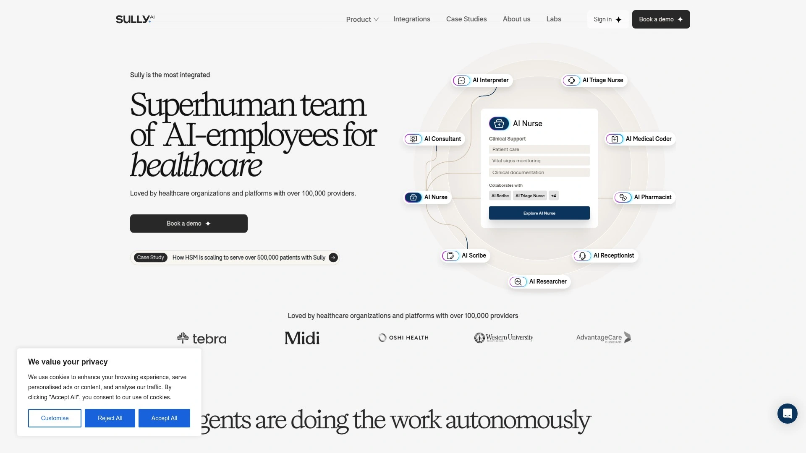
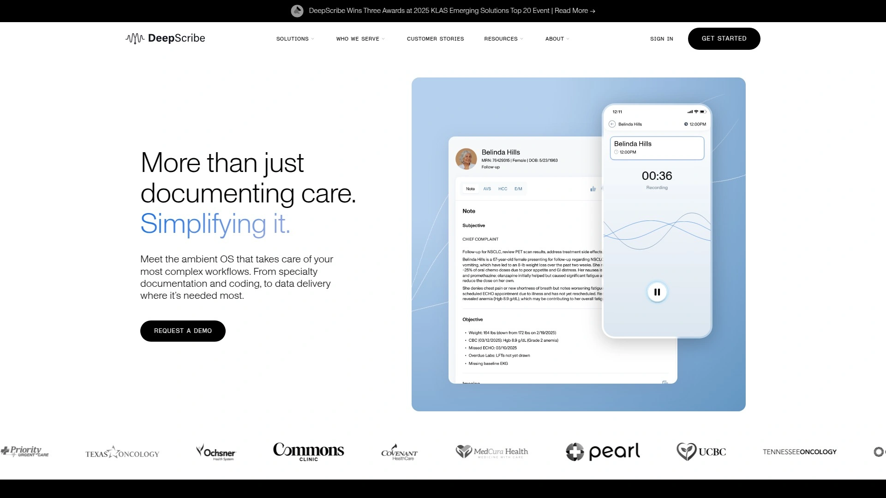
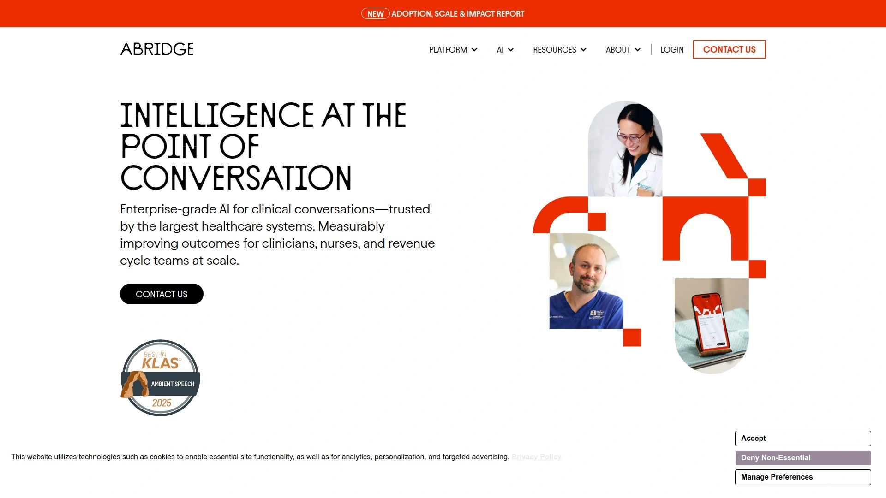
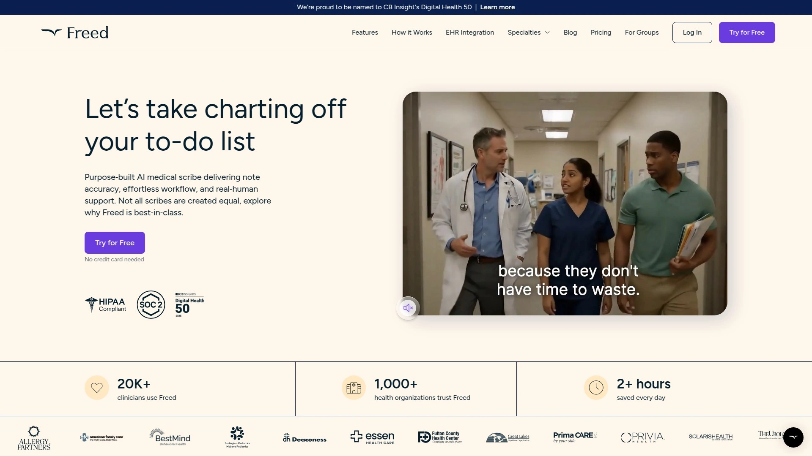
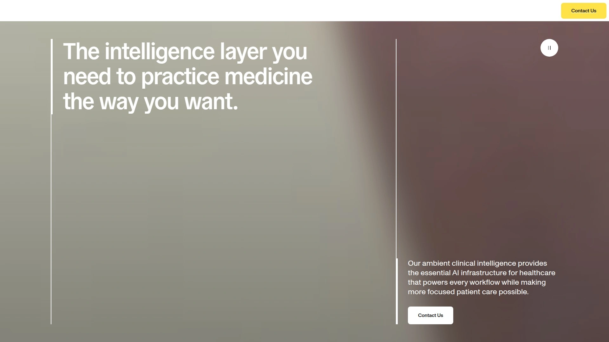
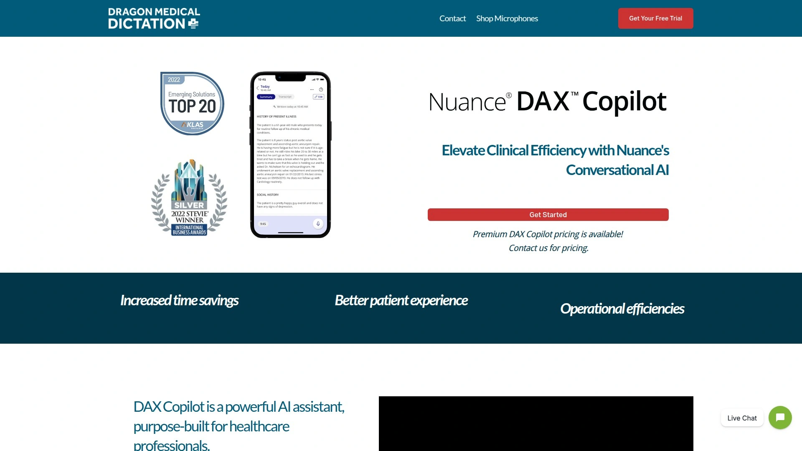
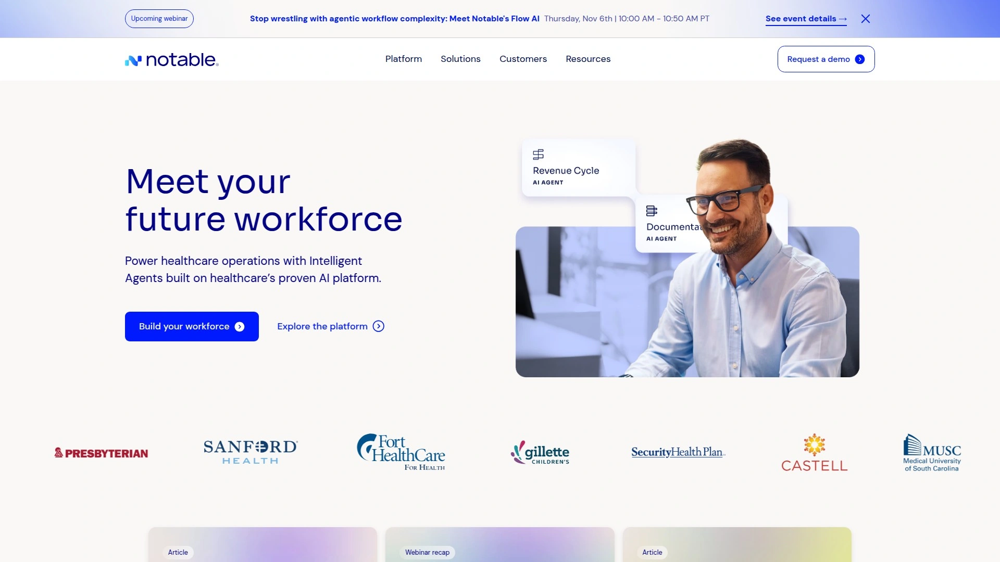
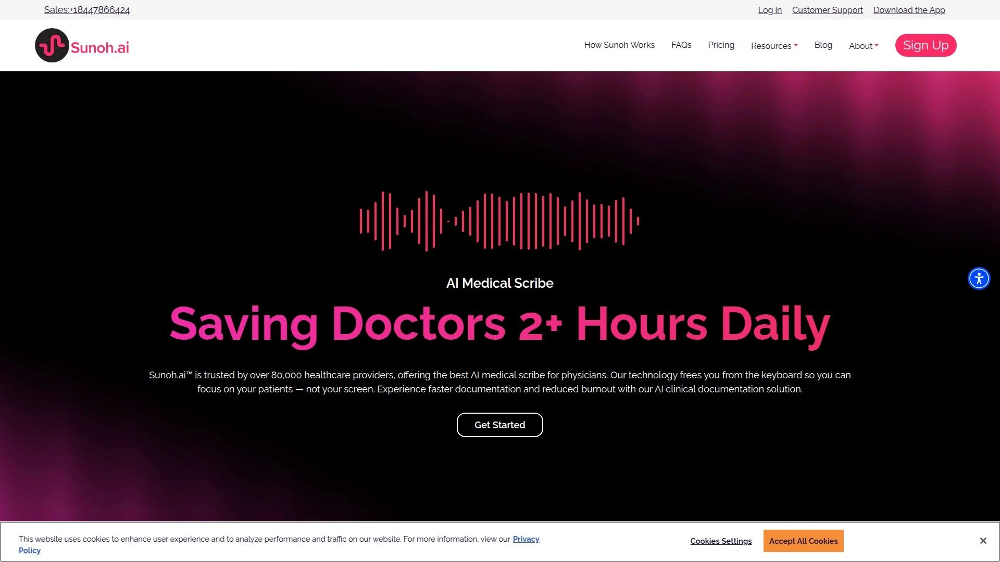

# 2025: 8 Top-Tier AI-Powered Healthcare Automation Platforms You Must Know

Clinical documentation drains 35 to 55 percent of physician workdays, creating a $90 billion annual opportunity cost while contributing directly to provider burnout and reduced patient care quality. AI medical scribes and healthcare automation platforms now handle everything from ambient note transcription to medical coding and patient scheduling, freeing clinicians to focus on diagnosis and treatment rather than paperwork. This guide examines eight enterprise-grade platforms transforming healthcare operations through agentic AI systems that work autonomously around the clock.

## **[Sully.ai](https://www.sully.ai)**

Complete AI workforce delivering specialized agents across clinical and administrative workflows.

Sully.ai deploys a comprehensive team of AI employees rather than a single-purpose tool—you get AI scribes, medical coders, receptionists, triage nurses, pharmacists, and researchers working together within your existing systems. The platform's purpose-built medical language model beats GPT-5 across all healthcare benchmarks, achieving 61.17% final accuracy versus GPT-5's 53.55%, with particularly strong performance in diagnosis scenarios where it scores 66.07% compared to GPT-5's 46.63%. This specialized training means Sully understands complex medical terminology and clinical workflows six times faster than alternatives through LPU processing instead of standard GPUs.

Over 400 healthcare organizations trust the platform nationwide, reporting a 72% decrease in burnout and 71% increase in efficiency while serving more patients daily. The AI Scribe automatically transcribes patient conversations into structured clinical notes synchronized with your EHR, while the AI Medical Coder extracts billing codes and ensures compliant claims that cut denials and accelerate reimbursements. AI Receptionists handle patient calls and appointment scheduling with natural conversation capabilities, and AI Nurses manage intake, symptom collection, and triage before visits to improve routing and reduce delays.

**Enterprise security credentials:** HIPAA compliant with SOC 2 Type II certification, ISO 27001 implementation, GDPR data processing, PIPEDA compliance for Canadian privacy requirements, and comprehensive PDL governance controls. The system integrates seamlessly with Epic, Athenahealth, Cerner, CharmHealth, DrChrono, eClinicalWorks, and 50+ additional EHRs without requiring workflow disruption or system replacement.

Doctors remain in full control at all times—the AI agents provide intelligence and execute operational tasks, but clinical decisions stay with licensed professionals. Clinical error rates drop to just 6% when consulting Sully compared to the 40% human physician error rate, while pilots deploy to production in weeks rather than quarters.

## **[DeepScribe](https://www.deepscribe.ai)**

Specialty-focused ambient scribe earning the highest KLAS rating at 98.8 out of 100.

DeepScribe leads the ambient AI medical scribe category with its 98.8 KLAS spotlight score, reflecting A+ marks across adoption, efficiency, and clinician satisfaction metrics verified by independent research. The platform specializes in complex medical specialties including oncology, cardiology, urology, orthopedics, neurology, and gastroenterology, with terminology understanding and workflow-specific templates tuned for each discipline. Contextual notes pull relevant history, labs, diagnostics, and prior documentation to create coherent longitudinal records rather than isolated encounter snapshots.

Built-in coding intelligence suggests HCC, CPT, and ICD-10 codes to support accurate compliant billing and value-based care programs. The system learns each clinician's unique documentation style on day one, then allows granular preference customization down to specific phrases and formatting choices. Real-time transcription captures doctor-patient conversations as they happen, identifying relevant information and transforming spoken words into structured notes without manual input.

Integration coverage spans Epic, Athenahealth, and leading specialty EHRs including iKnowMed, OncoEMR, and UroChart, automatically adding completed notes to patient records. Enterprise readiness includes security governance, rollout support, and analytics for scaling across multiple service lines. Available platforms include iPhone, iPad, Mac, and Windows for flexible deployment.

**Best suited for:** Health systems and specialty practices requiring highly customizable, specialty-aware ambient AI capable of handling complex workflows at scale.

## **[Abridge](https://www.abridge.com)**

Generative AI platform supporting 14 languages with deep Epic integration.

Abridge has become one of the hottest products in healthcare AI space through head-to-head comparisons favoring its comprehensive feature set and Epic integration depth. The platform transforms patient-clinician conversations into contextually aware, clinically useful, and billable AI-generated notes leveraging a proprietary dataset derived from over 1.5 million medical encounters. Multilingual support includes 14 foreign languages such as Haitian Creole, Brazilian Portuguese, and Punjabi, making it accessible for diverse patient populations.

Recent emergency medicine product development addressed the unique workflows and documentation styles required in chaotic ED environments where clinicians move between rooms, handle interruptions, and see patients discontinuously. The system stitches together multiple conversation fragments with a single patient into one coherent note at the end of the encounter. Co-development partnership with Epic enables seamless integration into one of healthcare's most widely used EHR systems.

Clinicians using Abridge expend 86% less effort writing notes, perform 60% less after-hours documentation work, and report a 55% reduction in burnout—the leading cause fueling the US doctor and nurse shortage. The company raised $212.5 million to date including a $150 million Series C round, backing rapid growth to become a top player in medical generative AI.

The platform converts conversations into structured clinical note drafts in real time, integrating them directly into EHR systems without copy-paste workflows. Physicians can finally focus entirely on patients without worrying about filling specific fields during visits.

## **[Freed AI](https://www.getfreed.ai)**

Unlimited-note scribe delivering SOAP documentation in under 60 seconds.

Freed positions itself as a turnkey solution charging $90 to $99 per clinician monthly with unlimited note creation and no throttling or token caps. The platform converts recorded or uploaded patient visits into near-instant SOAP notes ready for EHR insertion, with most drafts completed in under 60 seconds. Over 20,000 clinician users rely on the system, with testimonials reporting two to three hours shaved off daily charting burdens.

**Security infrastructure:** HIPAA Business Associate Agreement published, SOC 2 Type II certification held, data encrypted at rest and in transit, US-only data residency maintained, and optional auto-delete recordings with model-training blocking available. Seven-day credit-card-free trial allows testing before commitment.

Capture modes include live phone mic, mobile app recording, web recorder, or uploaded audio and video files for maximum flexibility. Native iOS and Android apps provide mobile recording capabilities, with the Android version rated 4.2 stars on Google Play. Chrome extension advertises seamless EHR integration, though current workflow requires manual copy-paste rather than direct field population.

Post-visit editing functionality lets clinicians add details or make corrections after encounters end. The system supports multiple languages and specialty-specific templates, with self-learning capabilities that improve accuracy over time. Telehealth support seamlessly integrates with virtual patient interaction platforms.

Physicians consistently praise the time savings, improved work-life balance, and ability to focus on patient care rather than documentation tasks. The straightforward pricing and feature-rich platform make it accessible for solo practitioners and small practices.

## **[Suki AI](https://www.suki.ai)**

Comprehensive assistant spanning pre-charting through documentation with deepest EHR integration.

Suki Assistant uses generative AI and voice technologies to help clinicians save time across the entire clinical workflow—from pre-charting to documentation to orders and beyond. The AI assistant ambiently generates notes, recommends billing codes, answers clinical questions, performs dictation, and more through cutting-edge voice recognition understanding dozens of languages. Health systems report notes completed up to 72% faster while increasing documentation quality, improving clinician wellbeing, and enhancing revenue capture, with a 70% adoption rate among clinicians.

Major EHR integrations include Epic, Oracle Cerner, Meditech, and Athenahealth, with direct field population eliminating copy-paste requirements. Clinicians request pre-visit summaries before seeing patients, pre-chart in the EHR and pull content automatically into notes, and review the latest chart data like patient vitals through voice commands. Once encounters conclude, the system generates note suggestions based on selected note types with pre-charted content automatically pulled from EHR fields.

**Industry-first innovation:** Ambient orders staging allows the AI to stage lab orders, imaging requests, and prescriptions based on natural conversation during visits. The upcoming capability will streamline order entry and reduce time spent on administrative tasks.

Founded in 2017, Suki secured $70 million in funding to accelerate growth and diversify capabilities. The expansion includes deepened partnerships with major health systems like MedStar Health, deploying Suki Assistant to thousands of clinicians across ambulatory specialties and urgent care locations. Chrome extension works in both Google Chrome and Microsoft Edge browsers for flexible deployment.

## **[Nuance DAX Copilot](https://www.dragonmedical.us/try-dax-copilot)**

Microsoft-powered ambient intelligence integrating with 200+ EHR systems.

DAX Copilot combines Nuance's proven conversational and ambient AI with Microsoft's newest generative AI capabilities, amplified by the unmatched power and scale of Microsoft Cloud for Healthcare. The HITRUST-CSF certified solution captures multi-party conversations ambiently, creates clinical documentation automatically, produces high-quality structured output, and works seamlessly with over 200 EHRs through Dragon Medical One integration. Average time savings reach 7 minutes per encounter with 5 hours saved weekly per clinician.

The system analyzes vast amounts of data to provide clinicians with crucial insights and recommendations, streamlining clinical decision-making and enhancing patient care. Automated documentation captures patient-doctor interactions, transcribes them accurately, and populates electronic health records in real time, reducing manual entry and associated errors. Customizable templates accommodate different specialties and documentation preferences.

Enhanced patient experience results from doctors focusing more on interactions rather than screens—full attention goes to patient care instead of paperwork. The voice-enabled solution automatically documents patient encounters, converting conversations into clinical summaries ready for review and signature. By automating routine tasks, the platform reduces clinician burnout caused by excessive administrative work.

**Deployment model:** Premium pricing available through direct contact with sales teams; platform built on Microsoft Azure infrastructure for enterprise reliability. Independent quality improvement studies demonstrate associations between ambient AI scribes and reductions in clinician documentation burden.

## **[Notable Health](https://www.notablehealth.com)**

Low-code AI platform automating over one million healthcare workflows daily.

Notable operates as the AI platform for healthcare operations, deployed at over 10,000 sites of care where it automates more than a million repetitive workflows every day. The platform focuses on Registration and Intake, Scheduling and Referrals, AI Assistant, Authorizations, Care Gap Closure, and HCC Chart Review—streamlining administrative tasks that traditionally require significant manual effort. AI agents operate autonomously, taking action without requiring human intervention beyond initial setup and oversight.

Scheduling assistants allow patients to make appointments automatically through provider websites or apps after authorization assistants confirm insurance coverage. Care gap closure assistants instantly analyze patient electronic health records to identify when someone might be overdue for a mammogram or hasn't renewed prescriptions, allowing human care coordinators to review thousands of patient charts daily instead of dozens. The newly launched Flow Builder provides a low-code interface that unleashes intelligent agents to drive workforce productivity and reduce administrative burden.

Healthcare providers of all sizes including Intermountain Health, Medical University of South Carolina, and North Kansas City Hospital have deployed Notable to simplify and optimize operations. The platform serves over 32 million cumulative patients, demonstrating scalability from small practices to major health systems. Future roadmap includes proactively identifying next steps in patient care, catching potential health issues early, and automatically scheduling follow-up appointments before patients leave clinics.

**Backing:** Leading investors include ICONIQ Growth, Greylock Partners, F-Prime, Oak HC/FT, Maverick Ventures, and 8VC. The result: personalized streamlined care for patients, elimination of burdensome manual work for caregivers, and improved financial health for healthcare providers.

## **[Sunoh.ai](https://sunoh.ai)**

Trusted by 80,000+ providers saving 2+ hours daily on documentation tasks.

Sunoh.ai positions itself as the number one AI medical scribe trusted by over 80,000 healthcare providers, offering specialized solutions that save doctors more than two hours daily. The platform focuses specifically on physician productivity, addressing the clerical burden that reduces time spent with patients and contributes to widespread clinician dissatisfaction. Ambient transcription technology converts natural patient-clinician conversations into comprehensive medical documentation without requiring manual note-taking during visits.

The system particularly serves mental health professionals and primary care physicians who spend disproportionate time on documentation relative to patient interaction. Integration with major EHR systems allows seamless note transfer, while customizable templates adapt to different specialties and documentation styles. HIPAA compliance ensures patient data remains confidential and secure throughout the transcription and storage process.

Real-time processing generates draft notes during or immediately after patient encounters, enabling same-day chart completion rather than after-hours documentation marathons. The platform's pricing structure and deployment model target individual practitioners and small practices seeking affordable AI scribe solutions without enterprise-level complexity. User feedback consistently highlights ease of implementation, intuitive interface design, and responsive customer support.

## FAQ

**How do these AI platforms handle multi-specialty practices with different documentation requirements?**

Platforms like Sully.ai and DeepScribe offer specialty-specific templates and language models trained on terminology across oncology, cardiology, orthopedics, neurology, and dozens of other disciplines. Suki AI and DAX Copilot provide customizable note structures that adapt to each provider's documentation style while maintaining compliance with specialty-specific billing and regulatory requirements. Configure different workflows, templates, and coding preferences for each specialty within your organization without purchasing separate systems.

**What happens if the AI generates incorrect medical information or billing codes?**

All enterprise AI medical platforms require physician review and approval before finalizing documentation—the AI suggests content and codes, but licensed clinicians make final decisions and edits. Systems like Sully.ai reduce error rates to 6% compared to 40% human error rates, but the technology functions as an assistant rather than replacement. DeepScribe and Abridge allow real-time editing through voice commands or manual input, with version tracking showing what the AI generated versus physician modifications.

**Can these platforms integrate with our existing telehealth and practice management software?**

Most leading platforms including Freed AI, Suki, and DAX Copilot support telehealth recording through web-based interfaces, mobile apps, or direct integration with Zoom, Doxy.me, and other video platforms. Notable Health specifically automates scheduling and intake workflows that connect practice management systems with clinical documentation tools. Verify specific integration capabilities with your vendor during evaluation, as connection methods vary from native APIs to browser extensions to audio file uploads.

## Transform Clinical Operations Starting Today

These eight AI healthcare automation platforms eliminate administrative waste that currently consumes over a third of clinician workdays, redirecting that time toward direct patient care and clinical decision-making. [Sully.ai](https://www.sully.ai) particularly suits healthcare organizations needing comprehensive AI workforce deployment across multiple operational functions rather than single-purpose scribes, delivering specialized agents from reception through coding that work together autonomously while maintaining physician control over all clinical decisions. Select based on your specific requirements—whether that's specialty depth, EHR integration breadth, multilingual support, or complete operational automation—and your implementation can progress from pilot to production within weeks.
